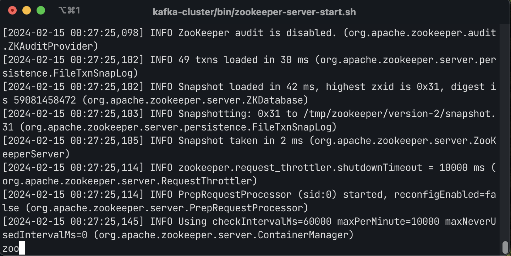
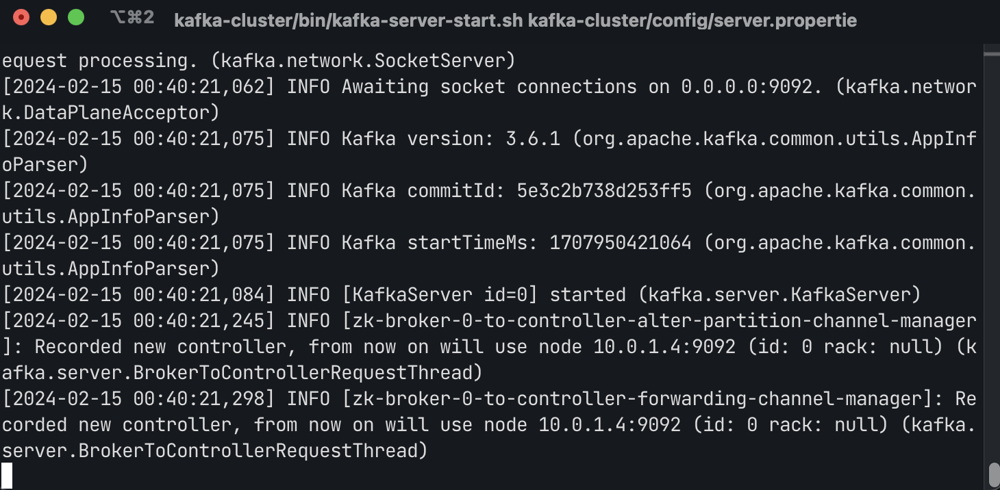

## Deployment/installation guide

### Prepare the environment

> **Note:**
> This deployment was done,tested and verified using Mac OS M2 local environment and it may differ if you use in other OS or environment. 

### Pre requisities :

- Latest version of Docker installed
- Docker compose 3.7
- Java JDK 11
- python3 installed 
- pip3 installed 

>I used Amazon distribution of OpenJDK 11
[Amazon Corretto 11 for macOS ](https://docs.aws.amazon.com/corretto/latest/corretto-11-ug/macos-install.html)

#### Prepare and run Kafka Cluster:

**1.** **Terminal 1:** Navigate to the directory -

`assignment-1-1033843/code/mysimbdp` 

**2.** Prepare kafka-cluser and Start Zookeeper, executing the `zoo-up-sh`file with below command - 

`bash zoo-up.sh`

> Downloaded and used Portable binary Apache Kafka downloaded from official [Apache Kafka](https://kafka.apache.org/downloads)

Expected console output of Zookeeper server should be similar - 

**3.** **Terminal 2:** Open 2nd Terminal window, nevigate to - 

`assignment-1-1033843/code/mysimbdp` 

and run the following command to start Apache Kafka -

`kafka-cluster/bin/kafka-server-start.sh kafka-cluster/config/server.properties`

**4** **Terminal 3:** Open 3rd Terminal window, nevigate to - 

`assignment-1-1033843/code/mysimbdp`

and run the following command to start Apache Kafka -

`kafka-cluster/bin/kafka-server-start.sh kafka-cluster/config/server-1.properties`

Expected console output of kafka server should be similar -

So now up & running -

- 1 zookeeper
- 2 kafka broker 

**Terminal 4** open 4th terminal window, nevigate to - 

`assignment-1-1033843/code/mysimbdp`

#### Setup the $PATH environment variable

For simplified terminal command use of kafka cluster, it is reccomended to edit your PATH variable to your system, add below line in `~/.zshrc` file on mac, reload the terminal, and nevigate to `assignment-1-1033843/code/mysimbdp` - 

For example - `sudo nano ~/.zshrc`

`PATH="$PATH:/Users/<your-user-name>/kafka-cluster/bin"`

> NOTE: PATH variable as mentioned was done for this deployment and several following steps of this document may seems different for a new environment if you do not set it properly.

#### MongoDB Shard Cluster Setup

It will up and run a minimum (for devlopment & test type) MongoDB sharded cluster container on docker -

- 1 config server
- 2 Shard Server
- 1 Mongo Router

Executing the `momgo-up-sh`file with the following command, start mongoDB shard cluster -

`bash mongo-up.sh`

#### Python Environment Setup and run Data ingest App

**1.** Run the following command to create a Python 3 virtual environment -

`python3 -m venv venv`

**2.** Activate the virtual environment using the following command -

`source venv/bin/activate`

**3.** Run the following command to install the dependencies listed in the `./app/requirements.txt` file -

`pip3 install -r ./app/requirements.txt`

**4.** **Create a kafka topic:** Create the Kafka topic `data-topic-1` with 3 partitions and a replication factor of 1 when Kafka broker is running at localhost:9092, with following command - 

`kafka-topics.sh --bootstrap-server localhost:9092 --topic data-topic-1 --create --partitions 3 --replication-factor 1`

A topic can be descried to verify, with the command - 

`kafka-topics.sh --bootstrap-server localhost:9092 --describe --topic data-topic-1`

**5.** **Run the data ingest app:** Run the producer with following command - 

`python3 ./app/producer.py -i ../../data/reviews.csv -c 10 -s 0 -t data-topic-1`

> This command runs the Python script producer.py with the following kafka arguments -
*-i ../../data/reviews.csv: input file in the path*
*-c 10: chunk size to 10 for processing*
*-s 0: sleep time between chunks to 0 seconds*
*-t data-topic-1: Kafka topic to data-topic-1* 

**2.** **Terminal 5** open 5th terminal window, nevigate to - 

`assignment-1-1033843/code/mysimbdp` 

**3.** Activate the virtual environment for your 4th terminal using the following command - 

`source venv/bin/activate`

**4.**  Run the consumer with following command - 

`python3 ./app/consumer.py -t data-topic-1 -g data-group-1 -n 3`

> IMPORTANT !
Make sure that you running consumer from **terminal 3** and producer from **terminal 4** while python virtual environment activated.

>This command runs the Python script consumer.py with the following command-line arguments -
*-t data-topic-1: Kafka topic as data-topic-1*
*-g data-group-1: consumer group as data-group-1*
*-n 3: number of consumers to run as 3*

### Test
With the following command, (may modify the file name and path as required) can get kafka broker level some performance metrics during execution of the data ingestion.

mysimbdp will produce different level of performace metrics in the log folder to analyse further.

`kafka-consumer-groups.sh --bootstrap-server localhost:9092 --all-groups --describe >> ../../logs/kafka_metrics_log_1.txt`

