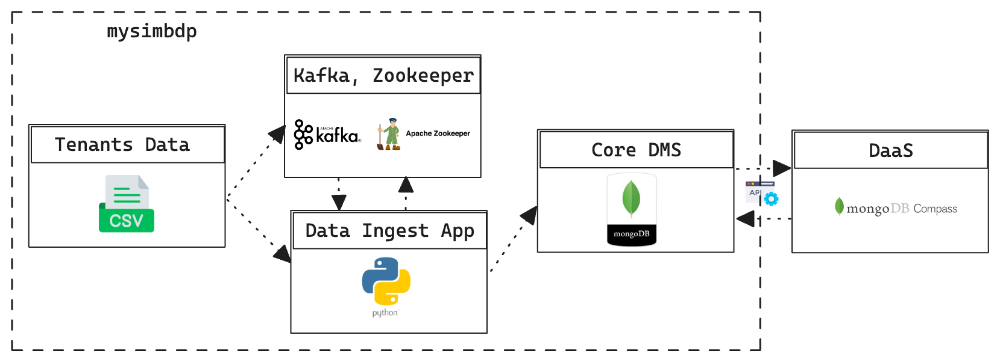
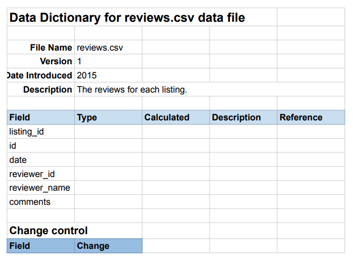
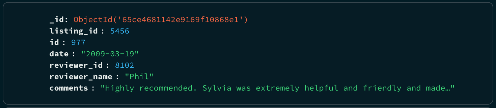
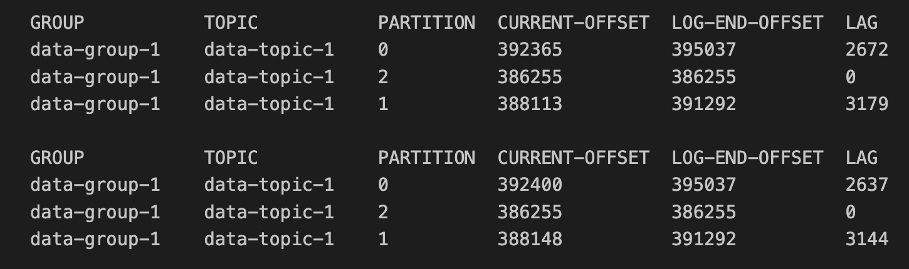
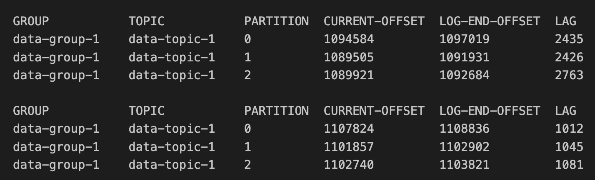
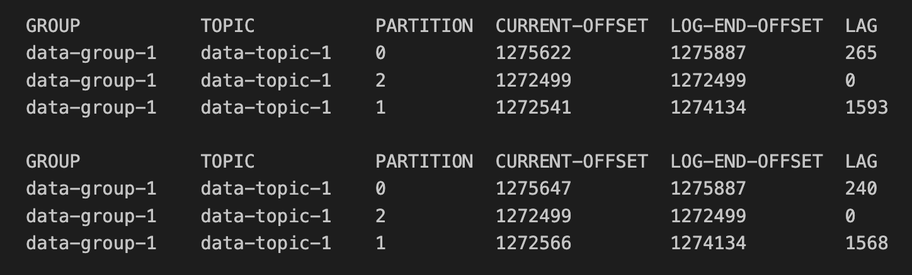
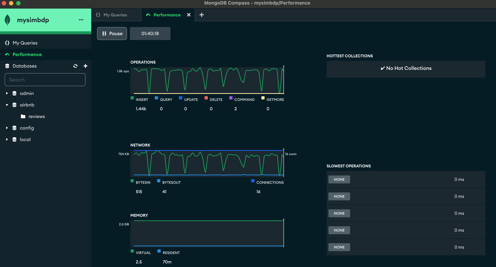
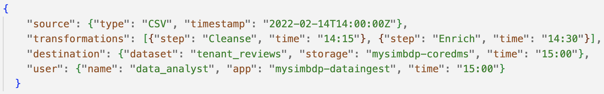
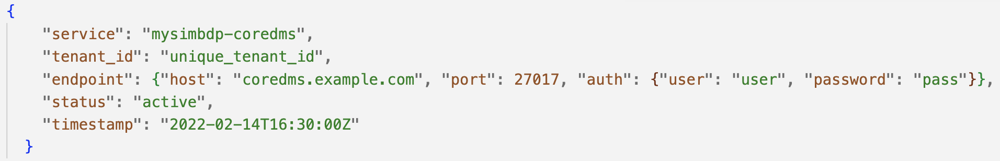

# Report

### Part 1 - Design

**mysimbdp-coredms:** A platform-as-a-service, to store and manage large datasets and its adaptability to unstructured and semi-structured data, MongoDB is the preferred Backend Database Management System (BDMS).

**mysimbdp-dataingest:** mysimbdp-dataingest reads data (.csv files) from its sources and employs Apache Kafka as the messaging system along with data ingest app (developed with python technology) for ingestion.

**mysimbdp-daas:** mysimbdp-daas provides APIs for external data producers and consumers, in this context for example MongoDB Compass act as mysimbdp-daas so that it can use mysimbdp-coredms from user level.

**1.**

Mysimbdp-coredms designed for large-scale data management with data usage application and scalability in mind. The chosen application domain supports CSV datasets, making it suitable for different kind analytic applications. The platform handles structured, semi-structured, and unstructured data well, meeting required data management constraints. Mysimbdp-coredms uses MongoDB as its Big Data Management System (BDMS) because sharding lets it store and handle enormous datasets horizontally. MongoDB's versatility, scalability, and simplicity of integration make it suitable for enterprises with large and changing data needs.

In mysimbdp, tenants may have mixed datasets from various apps, databases, or other systems. Mysimbdp-dataingest provides a flexible and consistent ingest strategy for this variety of data. The data ingest component enables tenants simply insert their data into mysimbdp-coredms from various sources. Tenants can upload CSV files, connect databases, or use Apache Kafka. Mysimbdp's agility allows it to handle and assess data from a selection of providers, giving a complete and encompassing solution.

The mysimbdp platform suits applications that require massive data storage, processing, and analysis. Mysimbdp-coredms, using MongoDB as the BDMS, efficiently manages large volumes of structured or semi-structured data. Since mysimbdp-dataingest uses Apache Kafka, it can handle high-throughput data ingestion scenarios, making it fit for transfer or large data influx applications. The platform's design architecture, and technology is designed for big data workloads, making it reliable and scalable for data-intensive operations.

**2.**

The mysimbdp-dataingest component uses Apache Kafka and Python-based Kafka producers and consumers to intake data. The Kafka producer reads CSV files and converts them into messages for Kafka topics. After that, a Python-implemented Kafka consumer collects these messages from the Kafka topics and loads them into mysimbdp-coredms, the MongoDB database cluster. Using Apache Kafka and MongoDB's powerful and scalable features, this approach assures a smooth data flow from sources to the mysimbdp platform.

*Figure 1 : mysimbdp architecture*

**mysimbdp Components:**

- **Tenants Data:** The data provided by tenants.
- **Kafka cluster:** A distributed and scalable messaging system. 
- **Data Ingest Python App:** Application to ingest data as CSV files into mysimbdp. 
- **Core DMS:** The core component for storing and managing data with a sharded MongoDB cluster.
- **DaaS:** An external component projected for future integration with mysimbdp. 

Mysimbdp using a distributed and resilient architecture which mporting CSV data from several sources, mysimbdp uses an Apache Kafka cluster and a custom Python data ingestion application. Data is produced into Kafka topics and ingested into mysimbdp-coredms. Data APIs in coredms allow smooth interface with external applications and sources. 

The mysimbdp platform uses external components like MongoDB and Apache Kafka. As an external service for scalable storage, MongoDB helps mysimbdp-coredms handle huge datasets. Mysimbdp-dataingest also uses Apache Kafka for high-throughput intake and seamless data streaming. These third-party solutions improve the platform's scalable storage, data streaming, and analytics without being developed by mysimbdp.

**3.** 

The horizontally scalable Kafka cluster and sharded MongoDB cluster of Mysimbdp-coredms together disseminate data over several nodes, offering fault tolerance and scalability. Separate datasets are managed via MongoDB shards, hence reducing the possibility of a single point of failure. The robust and highly available architecture of mysimbdp is enhanced by the mix of sharded MongoDB and horizontally scalable Kafka clusters, which further reduces downtime. The database and messaging system may both extend horizontally with this setup, guaranteeing flexibility and peak performance even as demand increases.

**4.**

For mysimbdp-coredms' distributed architecture, I've designed a replication technique. To accommodate computational and infrastructure constraints, I've built up two MongoDB shard clusters with two replica sets and a replication factor of 2. This meets capacity limitations while deviating from the replication factor of 3. MongoDB shards have two replica nodes. In case of node failure, replica nodes provide redundancy, ensuring data availability and system resilience. The replication factor may differ, but this design provides a scalable and resilient data storage solution for tenants/customers, allowing for future expansion as computational resources become available. For example mongo-shard-1 and mongo-shard-2 is having database technically in different locations. 

**5.**

Deploying mysimbdp-dataingest in two data centers with a common database requires practical placement. This method distributes workload and uses tenant data sources' proximity to data centers to optimize data ingestion. Tenants may have data sources in several locations, hence putting mysimbdp-dataingest in each data center enables efficient ingestion.

This deployment technique reduces network latency for tenants with data sources near data centers, optimizes resource use in each location, and improves fault tolerance. Synchronizing data centers and assuring regional performance may be difficult. Network overhead between data centers must be managed to avoid data transfer latency.

Balanced between pros and cons, this deployment technique assumes geographically spread tenant data sources and optimizes performance by deliberately using numerous mysimbdp data centers.

### Part 2 - Implementation

**1.**

The dataset used for the mysimple-dataingest / mysimbdp is in a .The dataset consists of customer reviews from Airbnb in CSV file format. The data schema obtained from Airbnb sources is accompanied by a clearly defined data dictionary, outlined as follows: 

>Data Source:
[Airbnb Customer Reviews Data](http://insideairbnb.com/get-the-data/)

*Figure 2 : Airbnb data dictionary*

- listing_id: Numeric identifier for the listing
- id: Numeric identifier for the review
- date: Date when the review was posted
- reviewer_id: Numeric identifier for the reviewer
- reviewer_name: Name of the reviewer
- comments: Textual content of the review

**2.**

The given data will be processed by MongoDB using a default document structure, which is akin to a JSON-like format, and is compatible with MongoDB. The "_id" field serves as a distinctive identification that is automatically created by MongoDB. This schema guarantees that every document accurately depicts a review and includes pertinent information about the listing, reviewer, and the review itself.

*Figure 3 : MongoDB JSON schema*

"listing_id" can be used for data partitioning/sharding. By using the natural distribution of "listing_id" values, this method ensures a balanced distribution and efficient query performance for cases where queries are often filtered by "listing_id."

**Data Partitioning/Sharding Strategy:**
**Shard Key:** Use "listing_id" as the shard key.
**Hash-Based Sharding:** Apply hash-based sharding on the "listing_id" field to evenly distribute the data across shards.

**Implementation for Data Partitioning/Sharding:** Based on the hash of the "listing_id." Each shard contains a subset of the data, and together, they form the complete dataset and has two replica nodes, enhancing fault tolerance and data availability.

**MongoDB Shard Cluster**

- 1 config server
- 2 Shard Server
- 1 Mongo Router

**mongo-shard-1:**
  - Replica 1
  - Replica 2
  
**mongo-shard-2:**
  - Replica 1
  - Replica 2

**Strategy Objective:**

Using "listing_id" sharding stores reviews for a listing together. Since the query can be directed to the relevant shard, retrieving listing reviews is faster. Scalability, fault tolerance, and data distribution are also benefits of sharding.

**3.**

The tenant's atomic data element/unit in mysimbdp-coredms is a single review entry from the given dataset. JSON reviews are complete units of information. It includes listing ID, reviewer info, review date, and review comments. These reviews are the foundation of mysimbdp-coredms' tenant dataset.

The consistency model controls distributed component synchronization and agreement. A distributed system like mysimbdp, where data is ingested into mysimbdp-coredms, can have strong consistency, where all nodes see the same data simultaneously, or eventual consistency, where all nodes converge to the same state, allowing temporary discrepancies. Choice of consistency relies on application requirements, latency tolerance, and desired consistency-availability trade-off. Different consistency models function differently and should be chosen based on application demands.

**4.** 

#### Testing and performance measuring

Test 2 stands out with 1,487.77 rows per second producer throughput and 852.80 rows per second consumer efficiency, showing a balanced and optimal arrangement. Both Test 1 and Test 3 perform well, although with lower throughput. Data generation and consumption are more efficient in Test 2, making it the best case. This greater performance comes from higher producer throughput and efficient consumer processing.

**Test 1**

>All reffered log files can be found in `logs`directory. 

Test 1 performance metrics data files:
`consumer_log_20240216_031113.txt`
`mongo_log_20240216_031113.txt`
`producer_log_20240215_164911.txt`
`kafka_metrics_log_1.txt`

*Figure 4 : Test 1 broker level metrics*

The Kafka data consumer in "data-group-1" with 3 consumers and a batch size of 500 processed and saved 422,808 rows in 104.12 minutes, a throughput of 67.68 rows per second. With no sleep time and a chunk size of 10, the Kafka data generator generated 586,292 rows in 1.10 minutes, averaging 8,870.22 rows per second. The MongoDB environment had 16 connections, 4 active and 93 created. BytesIn and bytesOut for the 422,500 insert operation were 145,881,993 and 80,560,564.

**Test 2**

Test 2 performance metrics data files:
`consumer_log_20240216_033458.txt`
`mongo_log_20240216_033458.txt`
`producer_log_20240216_033357.txt`
`kafka_metrics_log_4.txt`

*Figure 5 : Test 2 broker level metrics*

Kafka data producer configured for "data-topic-1" with no sleep time and chunk size 1 created 231,889 rows in 2.60 minutes, a remarkable 1,487.77 rows per second. The Kafka data consumer in the "data-group-1" consumer group with one consumer and a batch size of 40 processed and saved the same number of rows in 4.53 minutes, achieving 852.80 rows per second. The MongoDB environment had 16 connections, 4 active and 35 created. Insert counted 231,880, with 87,235,993 network bytesIn and 3,182,149 bytesOut.

**Test 3**

Test 3 performance metrics data files:
`consumer_log_20240216_044626.txt`
`mongo_log_20240216_044626.txt`
`producer_log_20240216_035543.txt`
`kafka_metrics_log_5.txt`

*Figure 6 : Test 3 broker level metrics*

In 51.88 minutes, the Kafka data consumer in the "data-group-1" consumer group with 3 consumers and a batch size of 1000 processed 241,161 rows at 77.47 rows per second. The Kafka data producer generated 231,889 rows in 0.30 minutes at 12,772.03 rows per second with a sleep time of 0 and a chunk size of 20. The MongoDB environment had 16 connections, 4 active and 48 created. Network bytesIn and Out were 90,955,526 and 106,780,363 for the 241,000 insert operation. 

**MongoDB monotoring and observation**

MongoDb Compass is an external tool to monitor , interact , or use core DMS as user level. I have discovered many performace / monitoring indication by investigating through this MongoDB native tool.

*Figure 7 : MongoDB monitoring by MongoDB Compass*

**5.**

When pushing a lot of data into "mysimbdpcoredms," several deployment adjustments can improve performance and reduce failures. First, provision enough CPU, memory, and storage or consider horizontal scaling. Batch and throttle data ingestion to avoid system overload. Optimize database indexing, investigate asynchronous processing, and provide proactive issue detection via monitoring alerts. Perform rigorous load testing to find bottlenecks and optimize setups. Protect against failure, split data, and optimize the deployment depending on changing needs and data trends. These measures boost mysimbdpcoredms' efficiency and robustness under heavy data loads.

### Part 3 Extension

**1.**

I want metadata to record the data source, transformations, destination dataset, and user/application details in mysimbdp-coredms to track data lineage. Metadata would include:

**Information Source:**
- Data source type (CSV, Database)
- Data source timestamp

**Transformation Steps:**
- Information about each transformation step, including its name and timestamp

**Destination Info:**
- Mysimbdp-coredms dataset name
- Data storage time stamp

**Insetion User**
- Name 
- Mysimbdp-dataingest app
- Time stamp of ingestion start

*Figure 8 : Lineage data example*

This practical example involves lineage data, where a CSV source with a timestamp passes through cleansing and enrichment processes at defined intervals. The data obtained is stored in the "tenant_reviews" dataset under mysimbdp-coredms at 15:00. The data analyst launched this process at 15:00 using mysimbdp-dataingest.

**2.**

The service information schema for mysimbdp-coredms in the registry includes the following to simplify tenant/user identification and service management:

- Service name: "mysimbdp-coredms".
- Id: Each tenant or user has a unique ID.
- Endpoint: Connection host, port, and authentication for the mysimbdp-coredms instance.
- Status: Service status (active, inactive, maintenance).
- Time: The latest registration or change timestamp.

*Figure 9 : Service info schema*

This example's service information schema comprises the service name, unique tenant ID, connection endpoint, status, and update timestamp. This schema can be published into a registry to efficiently retrieve tenant/user-specific mysimbdp-coredms instance information.

**3.**

Mysimbdp-dataingest service discovery might benefit from ZooKeeper and Consul. ZooKeeper might stabilize settings and possibly elect leaders for distributed coordination. Consul's dynamic service discovery features registered and discovered services, enabling health management and service availability. Initialization registered Mysimbdp-dataingest with ZooKeeper and Consul. ZooKeeper would coordinate and Consul would discover and register services. Mysimbdp-dataingest may dynamically retrieve essential service information based on the task using ZooKeeper and Consul client-side service discovery libraries. The platform's comprehensive and resilient service discovery approach is ensured.

**4.**

Adjusting the Kafka producer and consumer components would allow mysimbdp-dataingest to just interface with mysimbdp-daas for data interactions with coredms. The CSV data reader and Kafka sender remains mostly the same. I would create a Kafka topic for mysimbdp-daas consumption.

I'd create mysimbdp-daas data ingestion and retrieval APIs. Modifying the Kafka consumer in mysimbdp-dataingest would allow it to consume messages from the selected Kafka topic and perform API calls to mysimbdp-daas for data storage in coredms. This method controls data flow by involving mysimbdp-daas in all contacts between mysimbdp-dataingest and mysimbdp-coredms.